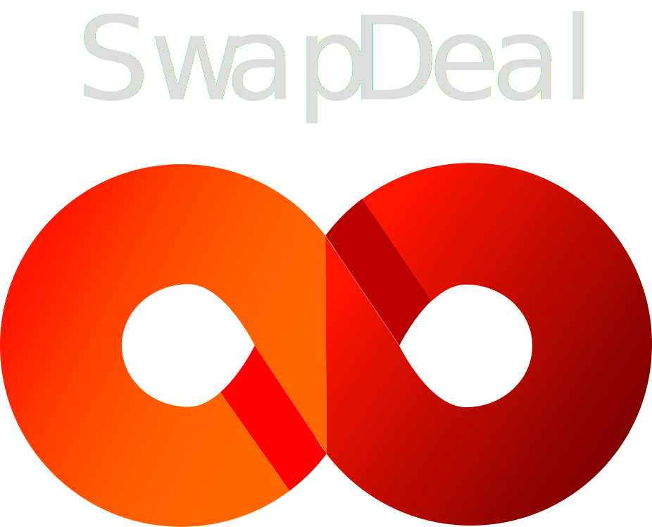

# SwapDeal



SwapDeal es una plataforma web para la permuta de bienes y servicios. Permite a los usuarios intercambiar directamente sin necesidad de dinero.

## Características

- **Intercambio de bienes**: Publica y encuentra artículos para intercambiar.
- **Intercambio de servicios**: Ofrece y solicita servicios diversos.
- **Sistema de valoración**: Valora los intercambios y construye tu reputación.
- **Mensajería interna**: Comunícate con otros usuarios directamente desde la plataforma.
- **Filtros de búsqueda**: Encuentra exactamente lo que necesitas con nuestros filtros avanzados.

## Instalación

1. Clona este repositorio:
    ```bash
    git clone https://github.com/TomasUllua12/SwapDeal.git
    ```
2. Navega al directorio del proyecto:
    ```bash
    cd swapdeal
    ```
3. Instala las dependencias:
    ```bash
    npm install
    ```
4. Inicia el servidor:
    ```bash
    npm start
    ```

---

